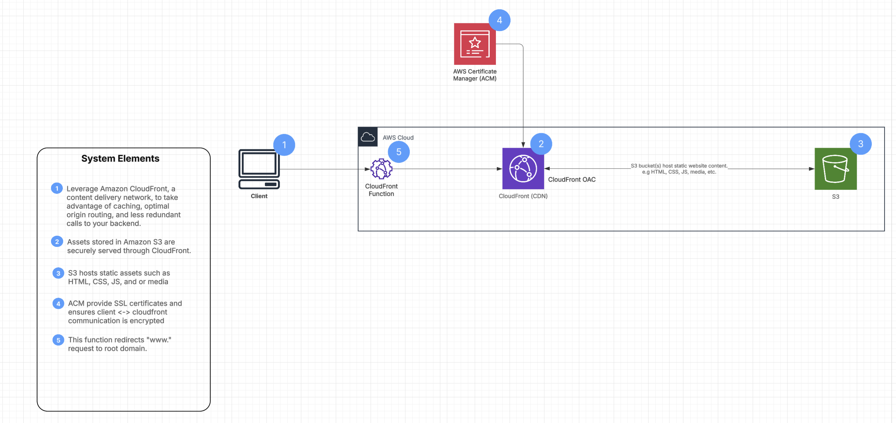
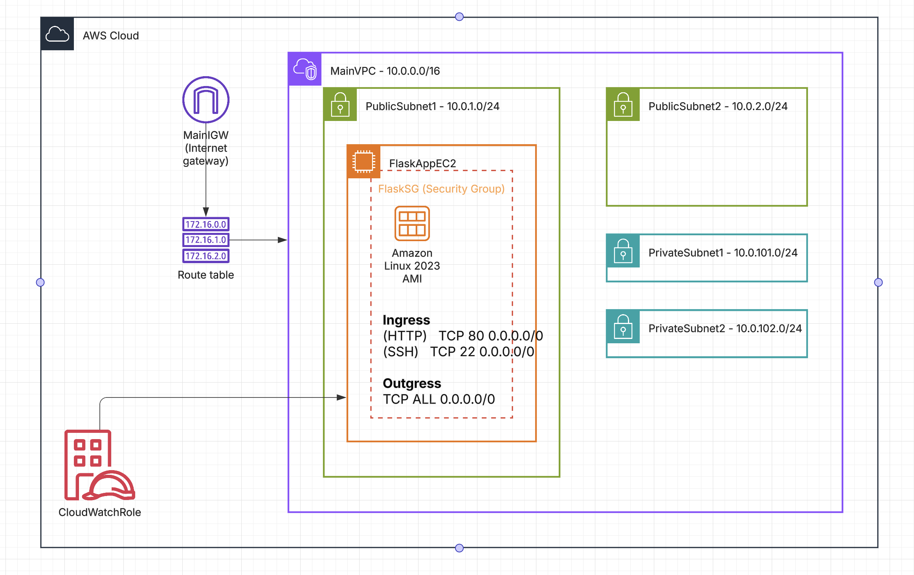

# GITOPS-PLAYGROUND

A Terraform-based template for deploying a lightweight Flask backend API, managed through the use of GitOps workflows, CI/CD pipelines, and infrastructure automation.

## Overview

This repository provides Terraform templates to quickly deploy both a static frontend website and a backend service using AWS infrastructure. The frontend is hosted on AWS S3, with CloudFront for content distribution and Route 53 for DNS management.
The backend service is a Flask app that runs as docker container inside an EC2 instance.

### Architecture

- **Static Frontend**: Hosted on an S3 bucket, served via CloudFront.
- **API Backend**: Running Flask on EC2, accessible through the same CloudFront distribution under the /api/* path.
- **CloudFront**: Configured with multiple origins to serve both the static content from S3 and the API from EC2. A CloudFront function is used to remove the "www." prefix from the domain.
- **Route 53 DNS**: Manages domain names and subdomains (e.g., static-website.example.com, api.example.com).

### CloudFront Setup — Multiple Origins

Two origins are configured inside one CloudFront distribution:
- Origin 1 (S3): Static site.
- Origin 2 (EC2): API.

Key CloudFront settings:
1. **default_cache_behavior**: Handles static content (targeting S3).
2. **ordered_cache_behavior** with path_pattern = "/api/*": Routes API calls to EC2.
3. Attached cache policies and viewer protocol policies for both.
4. **CloudFront Function** for www redirection.

### Route53 Records — Proper Domain Routing
1. A record for static-website.example.com -> CloudFront distribution.
2. A record for api.example.com -> Same CloudFront distribution (CloudFront routes to correct origin via /api/* pattern).
3. CNAME for www.static-website.example.com pointing to static-website.example.com for redirect.

**Note: Both frontend and backend share CloudFront, but routing depends on path and/or subdomain.

### CORS Handling — API (EC2 with Flask)

Initially:
- CORS issues when frontend called backend via CloudFront.
- Missing preflight (OPTIONS) response support.

✅ Resolved by:
- <strike>Adding Flask-CORS, correctly configured:
  ```python
    CORS(app, 
      origins=["https://static-website.example.com"], 
      supports_credentials=True,
      methods=["GET", "POST", "PUT", "DELETE", "OPTIONS"],
      allow_headers=["Content-Type", "Authorization"])
  ```
  </strike>
- Configuring CORS through nginx
  ```conf
    # Handle OPTIONS requests
    if (\$request_method = 'OPTIONS') {
        access_log /var/log/nginx/options_requests.log;
        add_header 'Access-Control-Allow-Methods' 'GET, POST, OPTIONS' always;
        add_header 'Access-Control-Allow-Headers' 'Content-Type, Authorization' always;
        add_header 'Access-Control-Allow-Origin' 'https://static-website.denisgulev.com' always;
        add_header 'Access-Control-Max-Age' 1728000;
        add_header 'Content-Type' 'text/plain charset=UTF-8';
        add_header 'Content-Length' 0;
        return 204;
    }

    # CORS headers
    add_header 'Access-Control-Allow-Methods' 'GET, POST, OPTIONS' always;
    add_header 'Access-Control-Allow-Headers' 'Content-Type, Authorization' always;
    add_header 'Access-Control-Allow-Origin' 'https://static-website.denisgulev.com' always;

    proxy_set_header Host \$host;
    proxy_set_header X-Real-IP \$remote_addr;
    proxy_set_header X-Forwarded-For \$proxy_add_x_forwarded_for;
    proxy_set_header X-Forwarded-Proto \$scheme;
    proxy_pass http://localhost:5000;
  ```
  Functionality:
  
  1. Handles OPTIONS Requests (Preflight Requests)
    - Checks if the request method is OPTIONS
    - Sets necessary CORS headers
    - Returns a 204 No Content response with appropriate headers
  2. Adds CORS Headers for Actual Requests
    - Ensures that actual requests also return CORS headers
  3. Proxying Requests to the Backend
    - Forwards requests to a backend running on localhost:5000
    - Sets headers to pass along client information

### Security Groups — Restricting EC2 to CloudFront

Ideally we want to restrict access to EC2 only for requests coming from the CloudFront.
Currently i am setting manually this, by choosing the **prefix list** of CloudFront.

🚀 **Next Steps**

<strike>Automate the usage of this prefix list through AWS lamdba, which will update the security group with the update prefix list of CloudFront.</strike> -> **DONE**
  - i managed to automatically retrieve the prefix list for CloudFront, by using the following
    ```terraform
      # Data source to fetch the CloudFront prefix list
      data "aws_ec2_managed_prefix_list" "cloudfront" {
        name = "com.amazonaws.global.cloudfront.origin-facing"
      }

      resource "aws_vpc_security_group_ingress_rule" "sg_ingress_http" {
        security_group_id = aws_security_group.flask_sg_http.id
        ....
        prefix_list_id = data.aws_ec2_managed_prefix_list.cloudfront.id
        ....
      }
    ```

### Terraform Workspaces — Cross-workspace Resources Issue

Problem:
- EC2 instance managed in a separate Terraform workspace/project.
- CloudFront defined in another workspace needs to use EC2’s public DNS as an origin.

✅ Solution:
<strike>
- Save EC2 instance as terraform variable in the workspace we want to reference the instance.
- Reference EC2’s public DNS
  ```hcl
    data "aws_instance" "imported_instance" {
      instance_id = var.ec2_instance_id
    }
  ```
➡️ **Note**: If EC2 is modified in its own workspace, updates won’t propagate unless you re-import or manage the resource cross-workspace properly (e.g., through Terraform Cloud workspaces or outputs).
</strike>

- in the backend setup, i save the ec2_dns inside an SSM parameter
  ```
    resource "aws_ssm_parameter" "ec2_dns" {
      name  = "/infra/ec2/public_dns"
      type  = "String"
      value = aws_instance.flask_app.public_dns
    }
  ```
- the frontend retrieves this parameter, if this is not found, a default value is set (in order to allow the static page to function)
  ```
    data "aws_ssm_parameter" "ec2_dns" {
      name = "/infra/ec2/public_dns"
    }

    locals {
      ec2_dns = try(data.aws_ssm_parameter.ec2_dns.value, var.ec2_dns)
    }

    resource "aws_cloudfront_distribution" "s3_distribution" {
      ...
      ...

      origin {
        domain_name = local.ec2_dns
        origin_id   = "EC2-origin"
      ...
      }
      ...
      ...
    }

  ```

### Automate Frontend Deployments — Both Infrastructure and Static Files

To streamline frontend deployments, we implemented a GitHub Actions workflow that automates the management of both infrastructure and static files. 

#### Infrastructure

The process begins when a pull request (PR) is created with changes to the **frontend/infra/** directory. Upon PR creation, a Terraform Plan is automatically executed, evaluating the infrastructure changes without applying them. A reviewer can then add a **ready-for-tf-apply** label to the PR, which triggers the Terraform Apply workflow to apply the approved changes. 

#### Static Files

Static files (HTML, CSS, JS) are automatically deployed to an S3 bucket when committed to the **frontend/static/** directory.

### Automate infrastructure changes via GitHub Actions

The process is similar to the one for the frontend flow.
When a pull request (PR) is created with changes to the **backend/infra/** directory. Upon PR creation, a Terraform Plan (Backend) is automatically executed, evaluating the infrastructure changes without applying them. A reviewer can then add a **ready-for-tf-apply** label to the PR, which triggers the Terraform Apply (Backend) workflow to apply the approved changes. 

#### *Notes on how deployments works*

Developers begin by working on changes in a dedicated feature branch. Once the work is complete, they open a pull request targeting the main branch. This initiates a structured deployment process:
1.	A Terraform Plan action is triggered automatically to preview infrastructure changes (handled separately for frontend and backend).
2.	If the plan succeeds and the proposed changes look good, a reviewer can apply the ready-for-tf-apply label to the PR.
3.	Adding this label triggers the corresponding Terraform Apply workflow to apply the infrastructure changes.
4.	If the plan reveals issues or requires improvements, the reviewer can leave feedback as a comment instead of applying the label.
5.	Once Terraform Apply completes successfully, the pull request is ready to be merged into the main branch.

## Frontend Setup

The static frontend app is described in detail in the following article:  
[Deploy a Static Website with AWS S3, CloudFront, and Terraform](https://denisgulev.com/static-website-with-aws-s3-cloudfront-and-terraform/).

In this article, you'll find a step-by-step guide on how to set up an S3-backed static website using Terraform, including CloudFront distribution, DNS configuration with Route 53, and more.

### Diagram



## Backend Setup

The backend service is deployed on a single EC2 instance running a simple Python Flask application. This backend architecture is designed to be minimal yet production-ready, including a robust networking layer, proper IAM permissions, and logging capabilities. 

All infrastructure components — from networking to compute and security — are fully managed and provisioned using Infrastructure as Code (IaC) through Terraform, ensuring consistent, repeatable, and easily maintainable deployments.

The backend app is described in detail in the following article:  
[Deploy an EC2 Instance with internet access](https://denisgulev.com/deploy-flask-backend-on-aws-ec2-with-terraform/).

### Architecture Components
- **EC2 Instance**: Hosts a Flask application.
- **Networking Layer**:
   - **VPC**: A dedicated Virtual Private Cloud for isolation and security.
   - **Public Subnets**: For resources that require direct access to the internet, including the EC2 instance.
   - **Private Subnets**: Reserved for future use, such as databases or internal services that shouldn’t be publicly accessible.
   - **Security Group**: Controls traffic to the EC2 instance with:
   - **Ingress Rules**: Allow HTTP (port 80), HTTPS (443) and SSH (port 22) access.
   - **Egress Rule**: Allows all outbound traffic.
   - **Internet Gateway**: Provides internet connectivity for the VPC.
   - **Route Table & Associations**: Routes traffic appropriately within the VPC and to the internet.
   - **IAM Roles**: 
      1. An iam role attached to the instance, granting permissions to write logs to CloudWatch Logs for better monitoring and observability.
      1. An iam role that allows to fetch prefix list ids for global CloudFront.

### Flask Application

The Flask backend exposes a single API endpoint as an example of a backend service. It is served using Gunicorn, a WSGI HTTP server for Python, behind Nginx, which acts as a reverse proxy for better performance and security.

### Diagram



## How to Use

1. Clone this repository:
   ```bash
   git clone https://github.com/denisgulev/gitops-playground.git
   cd gitops-playground
   ```
2.	Customize the variables in the frontend and backend directories to suit your needs.
3.	Follow the instructions in the linked article to deploy the frontend static website.
4.	Follow the instructions in the linked article to deploy the backend service.


## 📌 Future Developments  

- <strike>**Connect the Static Frontend with the Backend API**</strike> - **DONE**
  - Expose backend API under a proper domain (e.g., `api.example.com`).  
  - Configure CORS settings to allow frontend-backend communication.  
  - Update frontend to interact with backend endpoints.  

- <strike>**Implement CI/CD Pipelines for Frontend and Backend**</strike> - **DONE**
  - Automate frontend deployments (S3 + CloudFront invalidation) using GitHub Actions. 
  - Automate backend EC2 updates and infrastructure changes via GitHub Actions.  

    - I’ve split the infrastructure from the backend service (Flask app):

      1. The infrastructure code lives in the *backend/infra/* folder. Any PRs to the *main* branch that touch files in this folder will trigger the *terraform-plan-backend.yml* workflow. This kicks off a *terraform plan* process, and if that goes well, you can run *terraform apply* by adding the *ready-for-tf-apply* label to the PR.

      2. The backend service runs in Docker. Whenever changes are made in the *backend/app* folder and a tag is pushed, the *docker-build-push.yml* workflow runs, building a Docker image and pushing it to Docker Hub.

  - automate the deployment of docker image inside EC2 instance **DONE**
    
    ### 🚀 Automated Deployment Workflow for Flask App

    #### 🧱 Branch Structure
    -	**backend branch** -> Development branch. New changes are pushed here and tested by a reviewer or i may setup a workflow to test the changes.
      
    -	**main branch** -> Production-ready branch. After staging validation and management approval, changes are merged into main, version-tagged, and deployed to production through a gated process.


    #### 🛠 CI/CD Pipeline Overview

    ##### 1. ✅ Push to backend
      - The app is ready to be tested (currently requires a manual pull and local testing)
      - Once everything is tested, a PR is issued towards main branch

    #### 2. ✅ Merge backend → main and Create a Tag
      - Merge changes into main
      - Create a new Git tag (e.g., v1.0.0)

    #### 3. ✅ Tag Push → Build & Push Docker Image + PR for Deployment
      - GitHub Actions builds the image
      - Tags and pushes it to Docker Hub (e.g., flask-app:v1.0.0)
      - Appends the tag to **backend/app/deployment-version.txt**
      - After the image is pushed to DockerHub, a pull request is created:
      - From deploy/v1.0.0 → main
      - Adds labels (deploy, needs-approval)
      - Requires manual review/approval

    #### 4. ✅ Merge Deployment PR → Deploy to Production
      - Merging the PR triggers a deploy workflow:
        - Reads the latest tag from deployment-version.txt
        - using SSH logs into the production EC2 instance
        - Pulls and runs the new Docker image
        - Rolls back if the container fails health checks

- **Add Monitoring, Logging, and Alerts**  
  - Enable detailed **CloudWatch Logs** for backend (Nginx, Gunicorn, Flask).  
  - Set up **CloudWatch Alarms** for critical metrics (CPU, memory, HTTP errors).  
  - Configure notification systems (e.g., **SNS**, email, Slack) for alerts.  
  #### 📊 Observability Stack (Grafana + Loki + Promtail)

  This repository contains the GitOps-managed configuration to deploy a full observability stack on an AWS EC2 instance using Docker Compose and GitHub Actions.

  ##### 🧰 Stack Components
  
  Grafana -> Visualization & alerting platform
  
  Loki -> Log aggregation backend

  Promtail -> Log collector/forwarder from EC2 (Nginx, Gunicorn, etc.)

  #### 📁 Log Collection (via Promtail)

  Promtail is configured to collect logs from:
  - /var/log/nginx/*.log
  - /var/log/gunicorn/*.log

  Modify promtail-config.yaml to add more paths or services.

  #### 🌐 Accessing Grafana

  - Grafana will be accessible only internally to the team, there will not be a subdomain or route on the main website.

  #### 🔔 Alerting

  Grafana supports:
  - Log-based alerting
  - Notification channels (Email, Slack, Webhook, etc.)

  Alerts can be version-controlled using provisioning or exported JSON.


- **Security Hardening**  
  - Apply least privilege principles to IAM roles and security groups.  
  - Enable HTTPS for backend and frontend (SSL/TLS via ACM).  
  - Add security headers, rate limiting, and request validation to backend (Nginx/Flask).  
  - Consider adding **AWS WAF** and API throttling for additional protection.  
